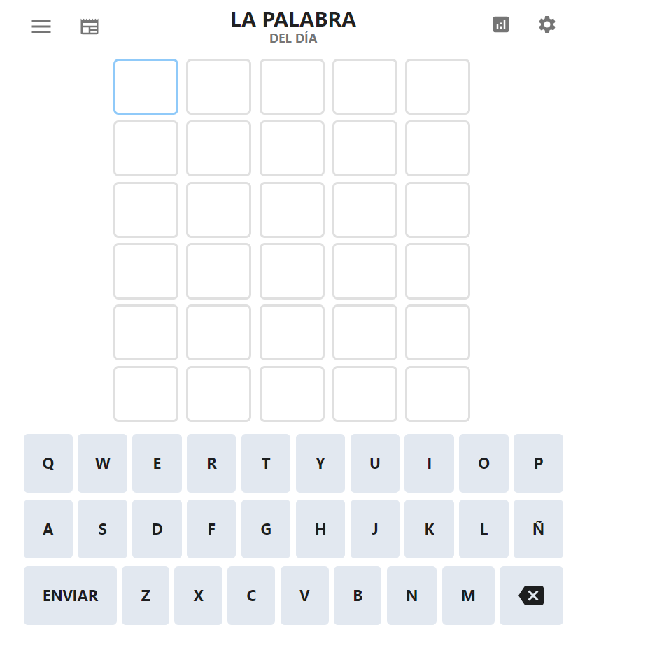

# Wordle
## Autor: Hugo Vicente Peligro

Tarea 3.10. Creando elementos del DOM: Wordle
 
Partiendo de un documento html vacío, crea los elementos HTML del wordle mediante los métodos del objeto predefinido document. Ni document.write() ni fichero.css están permitidos. Entrégala en este repositorio.

Sed eficientes y evitad la duplicación de código.

# Tarea 5.2. Delegación de eventos. Wordle
Retoma la práctica del Wordle y mediante la delegación de eventos añade el comportamiento del click a las letras. Esto significa que añadirás el comportamiento NO A CADA LETRA, sino al contenedor padre de todas ellas. Después, mediante evento.target averiguarás qué letra has usado.
Realiza la entrega en el mismo repositorio con el commit "feat: añade comportamiento clic con delegación de eventos"

Por otro lado, usa la delegación de eventos en la práctica anterior eventos de ratón. ¿Es posible? Utiliza tags para la segunda versión entregada en el mismo repositorio

No es posible. Ya que la delegación de eventos se aplica cuando solo vas a usar un evento dentro del contenedor al que se le aplica. Pero en el caso de la tarea de los eventos del ratón habría muchos eventos diferentes dentro del contendor que contiene los canvas.